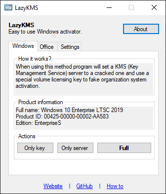

# LazyKMS
**Warning: This software is still in development. If you find any issues please try to report them so they can be fixed.**

LazyKMS is easy to use tool for activating Windows and Office by setting custom KMS server. It simplifies the process by automatically setting all the required things for you including the volume licensing keys and port setup for Office.

  

## Why to use this instead of any other Windows activator?
This tool is fully open-source and does not rely on any other software. It basically just executes few commands to do all the settings. You don't have to patch any system files and you don't have to have any process runnning. Run it once, delete it and forget about it.

## Download
You can download latest compiled version in [GitHub release section](https://github.com/SamuelTulach/LazyKMS/releases).

## Support and contribution
If you find any bug or error that you think should not be happening please [create an issue](https://github.com/SamuelTulach/LazyKMS/issues). If you have anything you would like to add, you can create a [pull request](https://github.com/SamuelTulach/LazyKMS/pulls).